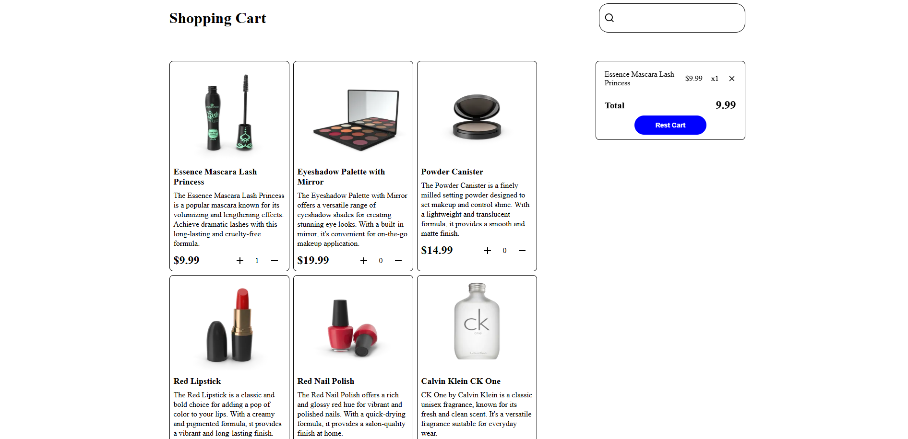
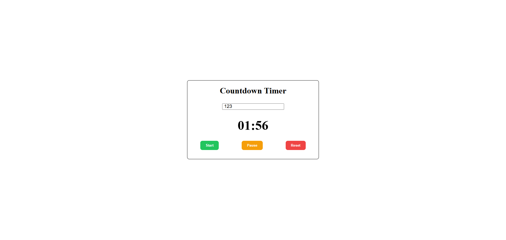
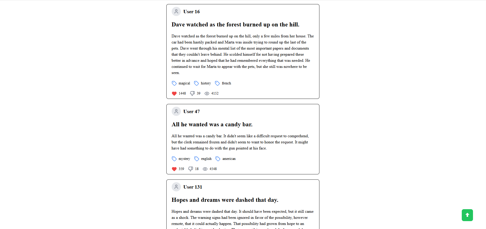
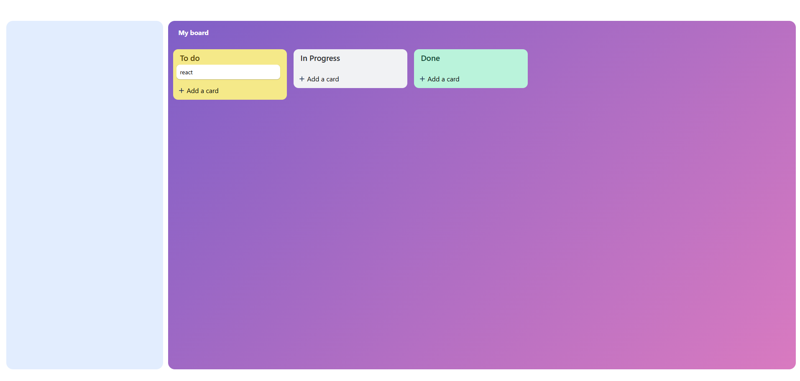

# Tech Stack

- React
- JavaScript
- Vite
- CSS
- Netlify

---

# ⭐ Reusable Star Rating Component

## Description

A reusable Star Rating component built with React.

Users can hover to preview ratings and click to select a rating value.  
The component is reused in 3 different places on the same page.

---

## Features

- Render 5 interactive stars
- Click to select rating
- Hover preview effect
- Restore selected value when mouse leaves
- Support `defaultValue`
- Support `onChange(value)` callback
- Reusable component design

---

## Knowledge Applied

- React Components
- Props
- useState
- Event Handling
- Conditional Rendering
- Reusable UI Components

---

## Live Demo

https://superlative-eclair-7b2134.netlify.app/

---

## Screenshot

---

# 🛒 Shopping Cart & Product Search

## Description

A React shopping cart application with realtime cart management and product search functionality.

Users can add products to the cart, update quantities, remove items, search products, and keep cart data persisted with localStorage.

---

## Features

- Display product list
- Add products to cart
- Increase/decrease quantity
- Remove single item
- Clear all cart items with confirmation dialog
- Prevent duplicate cart items
- Realtime total price calculation
- Realtime cart item counter
- Persist cart data using localStorage
- Product search functionality
- Debounce search input
- Loading and error handling
- Highlight matching search keywords

---

## Knowledge Applied

- React Components
- Props
- useState
- useEffect
- Event Handling
- Conditional Rendering
- Immutable State Update
- localStorage
- Debounce
- AbortController
- Search Filtering

---

## Live Demo

https://ephemeral-cannoli-51beae.netlify.app/

---

## Screenshot

---

# ⏳ Countdown Timer

## Description

A React countdown timer application with start, pause, and reset functionality.

Users can enter a number of seconds, control the timer state, and receive a notification sound when the countdown reaches zero.

---

## Features

- Input countdown time in seconds
- Start timer
- Pause and resume timer
- Reset timer
- Countdown updates in realtime
- Notification sound when time is over
- Cleanup interval on component unmount
- Prevent memory leaks
- Handle interval state using `useRef`

---

## Knowledge Applied

- React Components
- useState
- useEffect
- useRef
- Event Handling
- setInterval / clearInterval
- Cleanup Functions
- Stale Closure
- Timer Logic

---

## Live Demo

https://curious-entremet-0861f3.netlify.app/

---

## Screenshot

---

# 📰 Infinite Scroll Feed

## Description

A React feed application that automatically loads more posts when users scroll near the bottom of the page.

The project uses the Infinite Scroll pattern with `IntersectionObserver` for better performance and smoother user experience.

---

## Features

- Display post feed
- Automatic load more on scroll
- Infinite scrolling behavior
- Loading skeleton while fetching data
- Prevent layout shifting
- Detect end of data
- Show "No more posts" message
- Back to top button when scrolling down

---

## Knowledge Applied

- React Components
- useState
- useEffect
- useRef
- IntersectionObserver
- Infinite Scroll Pattern
- Conditional Rendering
- Loading Skeleton UI
- Scroll Handling

---

## Live Demo

https://glowing-sunflower-359f24.netlify.app/

---

## Screenshot

---

# 📋 Trello Style Task Board

## Description

A Trello-style task management board built with React.

Users can create, edit, delete, and drag cards between different columns.  
The application supports realtime board updates and persists data using localStorage.

---

## Features

- 3 columns: Todo / In Progress / Done
- Add and delete cards
- Drag and drop cards between columns
- Edit card using modal
- Realtime board updates
- Persist board state with localStorage
- Undo/Redo functionality
- Keyboard shortcut support with `Ctrl + Z`

---

## Knowledge Applied

- React Components
- useState
- useEffect
- useRef
- HTML5 Drag and Drop API
- Modal Components
- Immutable State Update
- localStorage
- Undo / Redo Logic
- Keyboard Events

---

## Live Demo

https://storied-gelato-80882d.netlify.app/

---

## Screenshot

